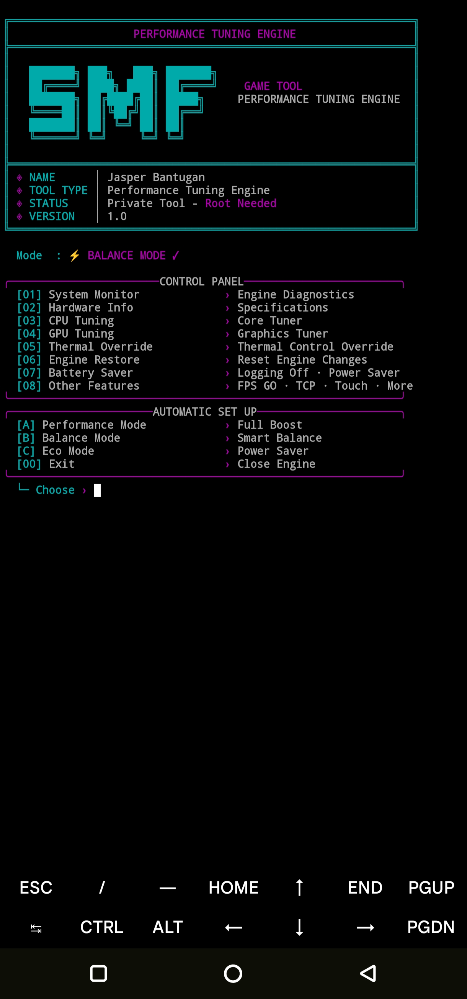
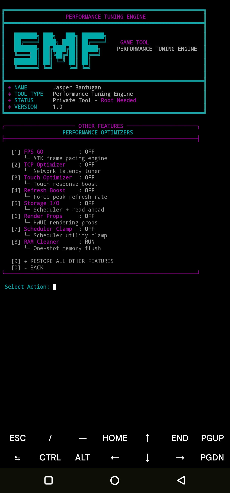

# SMF Performance Engine
**Unlock the full potential of your MediaTek device — right from Termux.**

Version: **1.0** · Made with ❤️ by Jasper Bantugan 🇵🇭

---

## 📖 Overview

**SMF Performance Engine** is a root-based Termux CLI engine designed to squeeze the full capabilities out of your MediaTek device. Unlike traditional tuning modules, it gives you **complete, direct control through a clean interactive TUI** — no WebUI, no cloud, no hidden services. Prefer shortcuts? You can also launch it **from a home-screen widget** with a single tap (Termux:Widget).

It talks straight to the kernel's sysfs/proc interfaces (`fpsgo`, `devfreq`, `cpufreq`, EM-DVFSRC, thermal zones), so you get **near-hardware-level tuning** with a simple menu. Everything you apply is snapshot-based, so a single **Engine Restore** command rolls it all back.

Whether it's **gaming, daily use, or battery saving** — one command switches your whole device profile.

---

## ✨ Key Features

### ⚡ System & Performance
- **A / B / C Profiles** — one-command presets: **Performance (A)**, **Balance (B)**, **Eco (C)** for instant mode switching.
- **One-Tap Widget** — launch straight from your home screen via **Termux:Widget** (steps below).
- **Thermal Override** — monkey-patches the tzone trip value to stop aggressive thermal throttling, while keeping thermal daemons running.
- **Battery Saver** — drops CPU/GPU bounds instantly for longer screen-on time.
- **DDR Floor** — writes `set_freq` on the **EM-DVFSRC** node to hold a minimum DRAM frequency (less jank with heavy apps).
- **FPS GO** — boosts FPS scheduler behavior for smoother frame pacing.
- **RAM Cleaner** — force-stops user apps and clears the recents/task list on demand.

### 🧠 Hardware & Kernel Tuning
- **CPU Control** — governor switching (`schedutil`, `performance`, …) and per-policy min/max scaling frequency lock, including max-limit lift.
- **GPU Control** — devfreq governor switching and GPU min/max frequency lock.
- **CPU Management** — fine-grained per-cluster frequency handling (policy0/4/7 on Dimensity/Helio SoCs).




### 🎛️ Other Features
- **TCP Tuning** — `tcp_*` sysctl tweaks for smoother network.
- **Touch Boost** — raises boost behavior based on touch input.
- **Refresh Rate** — locks/boosts panel refresh rate.
- **Storage I/O** — I/O scheduler tuning on block devices.
- **Advanced Rendering** — HWUI render props for smoother UI compositing.
- **Scheduler Clamp** — `sched_util_clamp_min` raised for snappier responsiveness.



### 🛡️ Safety & Restore
- **Engine Restore** — snapshot-based revert of every applied setting, restoring original values.
- **Boot Persistence** — replays your applied profile from `/data/adb/service.d/perfeng_boot.sh` after each reboot.

---

## ⚠️ Disclaimer

**Use at your own risk.** This engine writes directly to kernel sysfs/proc interfaces. Misconfiguration, thermal bypass, or overclocking may result in **instability, sudden reboots, bootloops, overheating, or missed notifications**.

- **Research first** — always check your device's specific constraints (frequency tables, thermal zones) before applying advanced tweaks.
- **Hobby Project** — this is a personal hobby project to learn and experiment, shared with the community **100% FREE**.

---


## 🚀 Installation & Instructions

> Requires a **rooted device** (Magisk/KernelSU recommended) and **Termux**.

**1. Update Termux and install required packages:**

```bash
pkg update && pkg upgrade
pkg install python git
```

**2. Clone and run:**

```bash
git clone https://github.com/JasperRecoverer/MTK-TERMINAL
cd MTK-TERMINAL
python PERF-MTK.py
```

**Quick Start:**
1. Launch with `python PERF-MTK.py`.
2. Press **B** for the safe **Balance** profile as your starting point.
3. Use **A** (Performance) for gaming, **C** (Eco) when you just need battery.
4. Explore `[03] CPU`, `[04] GPU`, `[05] Thermal`, and `[08] Other Features` as you learn what your device can handle.
5. Anything goes wrong? Go to `[06] Engine Restore` to roll everything back.


### 🏠 Widget Quick Launch (Termux:Widget)

Launch the engine from your home screen with a single tap:

1. Install **Termux:Widget** from F-Droid.
2. Create a shortcut script in Termux:

```bash
mkdir -p ~/.shortcuts
cat > ~/.shortcuts/PERF-MTK.py <<'EOF'
#!/data/data/com.termux/files/usr/bin/sh
python3 ~/MTK-TERMINAL/PERF-MTK.py
EOF
chmod +x ~/.shortcuts/PERF-MTK.py
```

3. **Hold** (long-press) an empty area on your home screen → tap **Widgets**.
4. Scroll to find **Termux** → tap the **Termux 1x1** widget.
5. Pick **`PERF-MTK.py`** from the popup menu → done, the widget is now on your home screen. Tap it anytime to launch.

> Root note: applying tweaks requires root. On your first apply, grant the **Magisk SuperUser** prompt (once is enough, so the widget works without interruption).

> 📌 **How it works:** Nothing outside your Termux folder is written until you apply a profile. On first apply, the engine auto-creates its boot replay script at `/data/adb/service.d/perfeng_boot.sh` (requires root) and its snapshot state — everything is reversible from `[06] Engine Restore`.

---

## 📖 Menu

```
[01] System Monitor
[02] Hardware Info
[03] CPU Tuning
[04] GPU Tuning
[05] Thermal Override
[06] Engine Restore
[07] Battery Saver
[08] Other Features
[A]  Performance Mode
[B]  Balance Mode
[C]  Eco Mode
[0]  Exit
```

---

## 💖 Support the Project

SMF Performance Engine is developed and maintained in my free time. While it will always remain **free and open**, you can show your support by:

- ⭐ **Starring** the GitHub repository
- 🤝 **Sharing** the project with others
- 📬 Reaching out for feedback or collaboration

---

## 📬 Contact & Links

- 🔧 **Repository:** https://github.com/JasperRecoverer/MTK-TERMINAL

Made with ❤️ by **Jasper Bantugan** 🇵🇭
